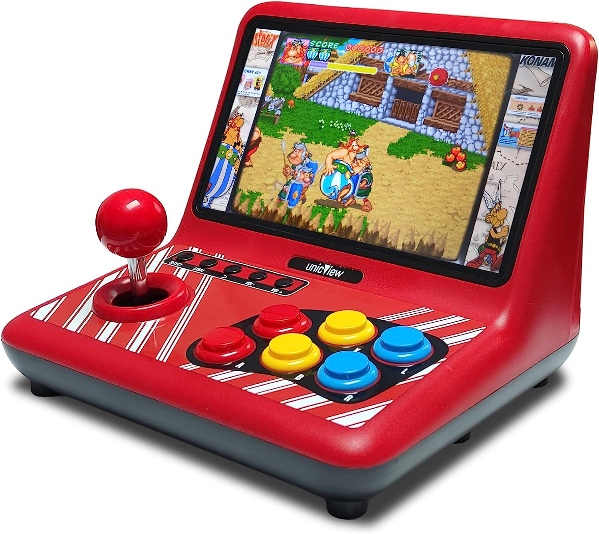
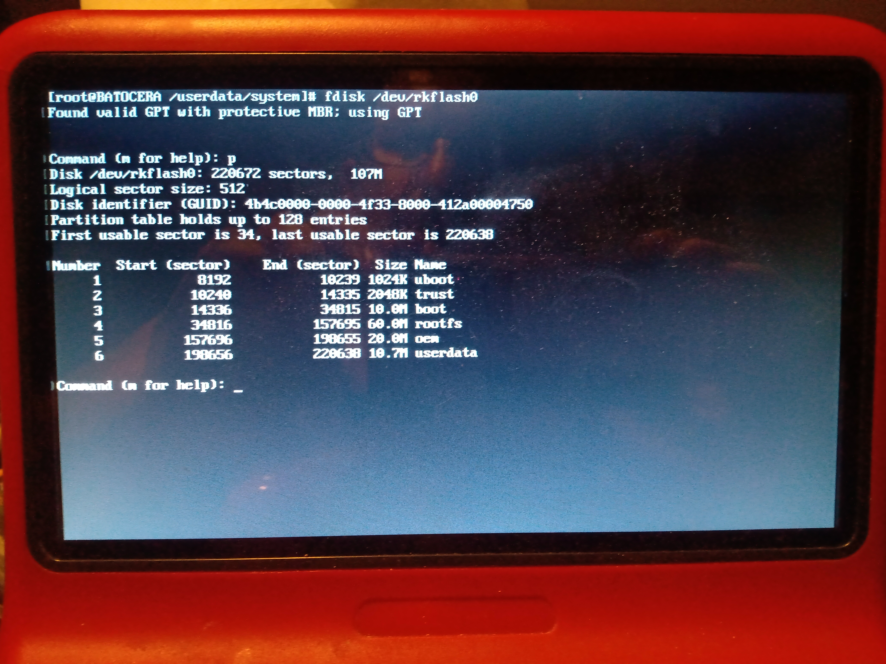
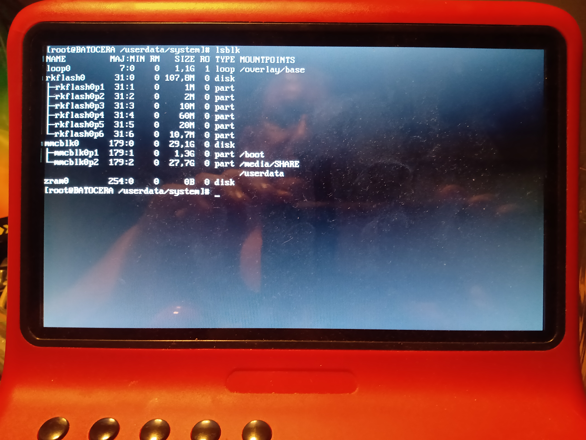

# Powkiddy-A12

### Actualización de la consola Powkiddy-A12

Para actualizar la consola PowkiddyA12 hay que seguir el método explicado en
<https://github.com/Ruka-CFW/rk3128-cfw> que te instala una versión custom de un Retroarch, de esa manera podemos jugar a los arcades y consolas más conocidas como Atari, PS1, GameBoy....
### Método de recuperación de la consola Powkiddy A12

Este método describe un modo de actualización para caso de fallo del método anterior. ¡¡OJO, UTILIZAR SÓLO EN CASO DE FALLO DEL MÉTODO DE RUKATEAM!!

Para empezar explicar que vamos a necesitar:

+ Un teclado usb.
+ Una tarjeta sd con alguna versión de linux que permita utilizar la consola, por ejemplo la de Batocera, yo uso la versión BOB.
+ La imágen backup de la PowkiddyA12 grabada en la sd.
+ Unos pocos conocimientos de linux.

La consola trae una placa con un SOC ARMV7 con varios dispositivos incluidos, uno de ellos un espacio de disco duro donde está instalado el sistema operativo.
Este sistema operativo viene divido en varias particiones donde guarda el contenido del arranque y demás.

La distribución de las prticiones es esta: 

Salida del comando fdisk /dev/rkflash0:

~~~
# fdisk /dev/rkflash0
~~~

¡¡OJO, EL IDIOMA DEL TECLADO VA A SER EN INGLÉS, TENERLO EN CUENTA!!

Procedimiento: 

+ Insertar la trajeta de batocera.
+ Asegurarse que la consola está alimentada, para evitar cortes por falta de batería.
+ Encender la consola con el teclado en el puerto usb de abajo.
+ Una vez iniciado batocera, sacar la consola de linux. La consola se saca con las teclas ALT+CTRL+F5, probar varias teclas de Función, dependerá de la versión de Batocera.
+ Para recuperar todo el backup se utilizará el disco completo /dev/rkflash0, para ello utilizar este comando:

~~~
# dd if=/ruta/a/la/imagen/backup.img of=/dev/rkflash0
~~~

Tarda muy poco, ya que la imagen es pequeña, unos 100MB.
En el ejemplo que pongo, la tarjeta de memoria sd en mi caso es mmcblk0 y el disco duro es rkflash0.

Salida del comando lsblk:

~~~
# lsblk
~~~

Lo bueno de este método es que se puede utilizar para grabar sólo la partición o particiones necesarias, por ejemplo, la actualización de RukaTeam graba dos particiones:
la boot y la root, se trata de identificar la necesaria y utilizar los comandos:

Para la partición boot:
~~~
# dd if=/ruta/a/la/imagen/boot.img of=/dev/rkflash0p3
~~~
Para la partición root:
~~~
# dd if=/ruta/a/la/imagen/root.img of=/dev/rkflash0p4
~~~

No olvides siempre hacer un backup del contenido original, para evitar pérdida de información.

Se puede hacer utilizando el comando dd:

~~~
# dd if=/dev/rkflash0 of=/ruta/a/la/imagen/backup.img
~~~
Espero que te ayude!!

